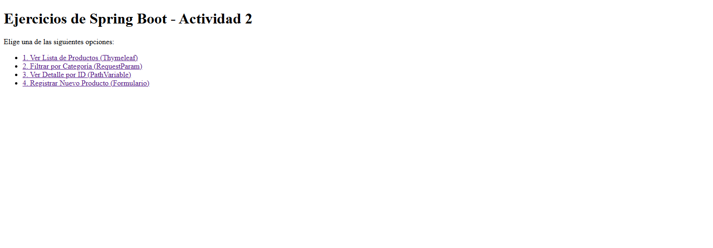
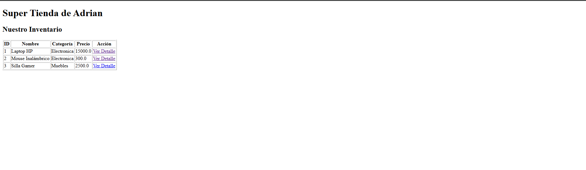
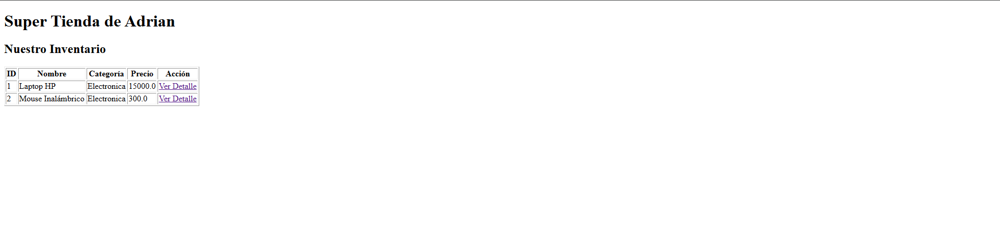
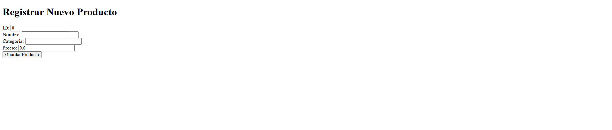
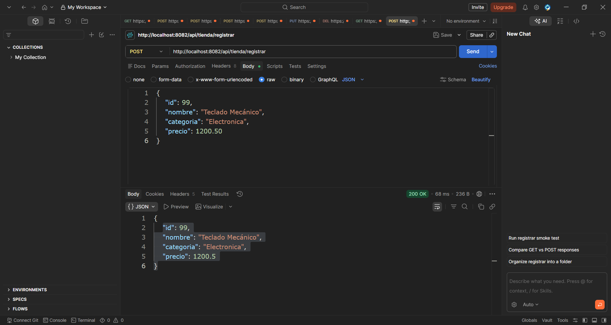

# Actividad 2: Aplicación MVC y REST con Spring Boot 

**Alumno:** Gonzalez Valentin Adrian  
**Materia:** Programación Web

---

## Descripción del Proyecto
Este proyecto es una aplicación web desarrollada en Spring Boot que funciona de forma independiente (en el puerto 8082). Su objetivo es demostrar el dominio del patrón MVC utilizando Thymeleaf para las vistas, transferencia de datos mediante DTOs, el uso de anotaciones web (`@RequestParam`, `@PathVariable`, `@ModelAttribute`, `@Value`) y la creación de un endpoint RESTful que responde en formato JSON.

---

## Desarrollo: Lo que se hizo paso a paso

Para cumplir con la rúbrica de la actividad, se implementó la siguiente estructura técnica:

*   **Configuración Inicial:**
    *   `pom.xml`: Inclusión de la dependencia `spring-boot-starter-thymeleaf`.
    *   `application.properties`: Definición del puerto independiente (`server.port=8082`) y una propiedad personalizada (`tienda.nombre`).
*   **Modelo de Datos (DTO):**
    *   Creación de la clase `ProductoDTO.java` para encapsular los atributos del producto (id, nombre, categoría, precio).
*   **Controladores:**
    *   `TiendaController.java`: Controlador MVC encargado de renderizar las vistas HTML, gestionar el formulario con `@ModelAttribute`, capturar parámetros con `@RequestParam` y extraer variables de la URL con `@PathVariable`.
    *   `TiendaRestController.java`: Controlador REST independiente con un método `@PostMapping` que recibe un objeto DTO y devuelve una respuesta en formato JSON.
*   **Vistas (Thymeleaf en `/templates`):**
    *   `index.html`: Página principal con el menú interactivo de navegación.
    *   `lista_productos.html`: Tabla dinámica que recorre los elementos usando `th:each`.
    *   `detalle_producto.html` y `formulario_producto.html`.

---

## Evidencias y Capturas de Pantalla

### A. Menú Principal en la Web

### B. Vista de Lista de Productos 

### C. Vista de Detalle 

### D. Filtro por Categoría 

### E. Formulario de Registro 

### F. Prueba del Endpoint REST (Postman)

---

